# [Share Bear - Community Tool Sharing ](https://share-bear-toolshare.herokuapp.com/)


[View the live project here.](https://share-bear-toolshare.herokuapp.com/)

I'm what you might call an enthusiastic DIYer.  I have no expertise in any building maintenance or repair and really have no affinity with it either....  but always feel I should *go-it-a-go* (much to the exasperation of my long-suffering wife).  So I'm often embarking on a new project to repair or update a part of our aging victorian house, of which it so often needs.

After much researching on how to complete the job I often discover that to do it properly, which at this point at least is my intention, I need to purchase a new, shiny tool.  The tool usually seems like a good investment, after all, I'm saving money by doing the job myself right.  The problem is , if I take a stroll down to my shed right now and peer in, I've got shelves and shelves of tools that I've bought for previous jobs and are practically untouched or used only once or twice , literally gathering dust and housing spiders.

You can hire tools of course, but looking online its not a lot less than buying, except for JCBs and other large machinery.

Looking out from my house, across the gardens up and down my street I can see every one has a shed and I'm certain most include garden tools, lawnmowers , ladders and a variety of other barely used tools and machinery.... slowly rusting away and rarely used.  Surely it would make better sense to share these tools.  Financially, environmentally and to save space too.

My idea is Share Bear. A community based organisation, which means its for the benefit of local people to make use of it but also to contribute, volunteer and run it.

I'd love to expand on the idea and set up a project that would work a little like Vinted or Facebook Marketplace, where users deal with each other directly, but for sharing tools.. in fact sharing anything really. Why stop at tools!  However, that format I quickly realized  was out of my scope as regards my current knowledge of Django and time, so opted for the below approach - 

1. People can browse the tool catalogue and borrow as many tools as they need for a week at a time.  There is a nominal price on each product to cover maintenance and upkeep of the tools.  Plus this gives me the opportunity to fulfil the 'online payment processing' criteria requirement, needed to complete my Diploma.

2. After completing the payment, the user will need to come to the utopian space that is the Share Bear shop, whereby they can collect their items and receive instruction or demonstrations on how to use it.  And if they have time,  hang for a while with one of the fine volunteers, sharing a cup of good, responsibly sourced coffee!

3. One week later, return the items as clean as when taken. Feeling just a little smug that they saved money, saved space and saved the environment... well ok, only a little, but it all helps.

Why is this such a good idea. 

- Financial - Everyone is generally harder up these days, what with the increases in the cost of living.  This is an opportunity to save money while maintaining/improving your assets ie house.
- Environmental - The average drill gets used for 13 minutes in its lifetime.  Thats a lot of drills being made and not getting used, to then end up as scrap or waste.
- Space - Keeps that space in the shed for whats important.  Getting those bikes in and out easily maybe. Or playing darts.

---


## **USER EXPERIENCE (UX)** ##

The project was created in order to fulfil the criteria of the L5 Diploma in Web Application Development that I'm completing. This is for Unit 4: Full Stack Frameworks with Django.

The unit aims to provide knowledge and skills needed to build a Full Stack web application. Topics include the use of frameworks, API's, persistent storage, user authentication and e-commerce functionality.


### User Stories

"**_As a user, I would like to_** _____________________________"

:heavy_check_mark: *denotes items that have been successfully implemented*

1. Viewing and Navigating the site
- :heavy_check_mark: *view* all the items in one place.
- :heavy_check_mark: *view* individual items for further details such as price,description,availability and an image
- :heavy_check_mark: *view* the items by specific type or category. ie Garden tools.
- :heavy_check_mark: *view* the items by specific order. ie sorting by price.
- :heavy_check_mark: *view* the items that are available.
- :heavy_check_mark: *view* an items available date if currently unavailable.
- :heavy_check_mark: *view* how much the individual items are and a running total of all items chosen.
- :heavy_check_mark: *view* items in a bag to be purchased.
- :heavy_check_mark: *view* a selection of tools that fit my search parameters. ie name or category.
- :heavy_check_mark: *view* articles about ways to help save the environment, money or space.
- :heavy_check_mark: *view* more information about community events that taking place to help save the environment, money or space.


2. Registration and User Accounts
- :heavy_check_mark: *Register* for an account and view my profile.
- :heavy_check_mark: Easily log in and logout of my *User Account*.
- :heavy_check_mark: Easily recover my password for my *User Account*.
- :heavy_check_mark: Receive an email confirmation after *registering*.
- :heavy_check_mark: have access to my personalized *User* profile address and phone number.
- :heavy_check_mark: have access to my personalized *User* profile to see my previous orders.
- :heavy_check_mark: have access to my personalized *User* profile to see the events I'm attending.


3. Community information and events
- :heavy_check_mark: receive information via email about *events* Share Bear are organizing.
- :heavy_check_mark: receive regular *information* via email about Share Bear in general.


4. Online payment process
- :heavy_check_mark: view clearly the items I'm going to *pay* for.
- :heavy_check_mark: safely complete a *payment* for the items, with prompts and confirmation.
- :heavy_check_mark: receive confirmation the *payment* was successful.
- :heavy_check_mark: receive confirmation of the order on screen with details about the next steps.
- :heavy_check_mark: receive confirmation of the order via email with details about the next steps.


"**_As a user and staff member, I would like to_** _____________________________"

1. Add, Edit and Delete items.
- :heavy_check_mark: easily *add* new items available to borrow.
- :heavy_check_mark: easily *edit* items information. changing stock, availability or details
- :heavy_check_mark: easily *delete* items if no longer an item Share Bear offers.

2. Add, Edit and Delete Blogs.
- :heavy_check_mark: easily *add* new blogs. Information and images
- :heavy_check_mark: easily *edit* blogs to update information and images.
- :heavy_check_mark: easily *delete* blogs that are out-of-date or no longer of interest.

3. Add, Edit and Delete Events.
- :heavy_check_mark: easily *add* new Events. Information, image, date, location and organiser.
- :heavy_check_mark: easily *edit* events to update current information.
- :heavy_check_mark: easily *delete* old or cancelled events.


## Design  

#### Colour Scheme

Though the site has E-commerce functionality, I felt it should have a less sterile feel than most do, but still showcasing the items.  Most ecommerce sites keep the colours neutral , with white or off-white backgrounds, but i wanted to offer up a friendlier tone.
-  `#e76f51` (**Burnt Sienna**)
-  `#e8f2f1` (**Light Blue**)
-  `#2a9d8f` (**Dark Green**)

#### Typography

- I used [Google Fonts](https://fonts.google.com/) for my application. 

-Throughout the site I used 'Chivo Mono' for the text. With a grey colour. 

- [Chivo Mono](https://fonts.google.com/specimen/Chivo+Mono)


#### Icons

- [Font Awesome 6.3.0](https://fontawesome.com/)
    - These where used throughout the site. including  the navigation icons, the increment/decrement icons and social icons.


### WIREFRAMES 

Please click on the individual Apps to see all wireframes.

- [Wireframes Home App](readme_media/wireframes/home)


- [Wireframes Items App](readme_media/wireframes/items)


- [Wireframes Profile App](readme_media/wireframes/profile)


- [Wireframes Events](readme_media/wireframes/events)


- [Wireframes Blog](readme_media/wireframes/blog)


- [Wireframes Bag](readme_media/wireframes/bag)


- [Wireframes Checkout](readme_media/wireframes/checkout)


- [Wireframes Checkout Success](readme_media/wireframes/checkout_success)


---
## **THE DATABASE** ##

I chose to use PostgreSQL, a relational database system for my app as I felt there was going to be clear defined relationships between the tables and the data therein. I felt an RDBMS would be well suited to query and manage the content for my needs.

The relationships between the models mostly stem from either the User or the Items.  
The schema allows for the following:
-  Users profiles to access the allauth user information.
-  Orders to be linked to an individual User and display on their profile page.
-  Order items (OrderLineItem) to be linked to both Order and Item.
-  Items to be linked to their particular Categories for sorting and display purposes.
-  Blogs/Articles author linked to a User.
-  Events organiser to be linked to a User.
-  Newsletter subscribers linked to existing Users.


**User**
```
id: <BigAutoField>
username : <Charfield>
email: <EmailField>
```

**UserProfile**
```
id: <BigAutoField>
user: <OneToOneField>
default_phone_number: <CharField>
default_street_address1: <CharField>
default_street_address2: <CharField>
default_town_or_city: <CharField>
default_county: <CharField>
default_postcode: <CharField>
default_country: <CountryField>
```

**Order**
```
id: <BigAutoField>
order_number: <CharField>
user_profile: <ForeignKey>
full_name: <CharField>
email: <EmailField>
phone_number: <CharField>
country: <CountryField>
postcode: <CharField>
town_or_city: <CharField>
street_address1: <CharField>
street_address2: <CharField>
county: <CharField>
date: <DateTimeField>
order_total: <DecimalField>
original_bag: <TextField>
stripe_pid: <CharField>

```

**OrderLineItem**
```
id: <BigAutoField>
order: <ForeignKey>
item: <ForeignKey>
quantity: <IntegerField>
lineitem_total: <DecimalField>

```

**Category**
```
id: <BigAutoField>
name: <CharField>
friendly_name: <CharField>

```

**Item**
```
id: <BigAutoField>
category: <ForeignKey>
name: <CharField>
description: <TextField>
manufacturer: <CharField>
price: <DecimalField>
image_url: <URLField>
image: <ImageField>
availableDate: <DateField>
stock: <PositiveIntegerField>

```

**Article**
```
id: <BigAutoField>
title: <CharField>
slug: <SlugField>
body: <TextField>
date: <DateTimeField>
thumb: <ImageField>
author: <ForeignKey>

```

**Event**
```
id: <BigAutoField>
organiser: <ForeignKey>
title: <CharField>
slug: <SlugField>
body: <TextField>
date: <DateTimeField>
attendees: <ManyToManyField>
interested: <ManyToManyField>
location: <CharField>
thumb: <ImageField>

```

**Newsletter**
```
id: <BigAutoField>
first_name: <CharField>
email: <EmailField>
is_registered_already: <ForeignKey>

```


---
## **FEATURES** ##

### **Site-wide Features** ###

1. Responsive on all device sizes.

2. Easily navigate to all other parts of the site, regardless of where you are.

3. Visability of bag total on all pages.


### **App Features** ###

#### **Home App** ####

* Clear responsive navigation that can take you to the items, blogs, events or profile pages.
* Information about the purpose of the organisaion and a button for quick access to the tools available.
* Information of the process of 'borrowing' items.
* Search the site via the search bar.
- 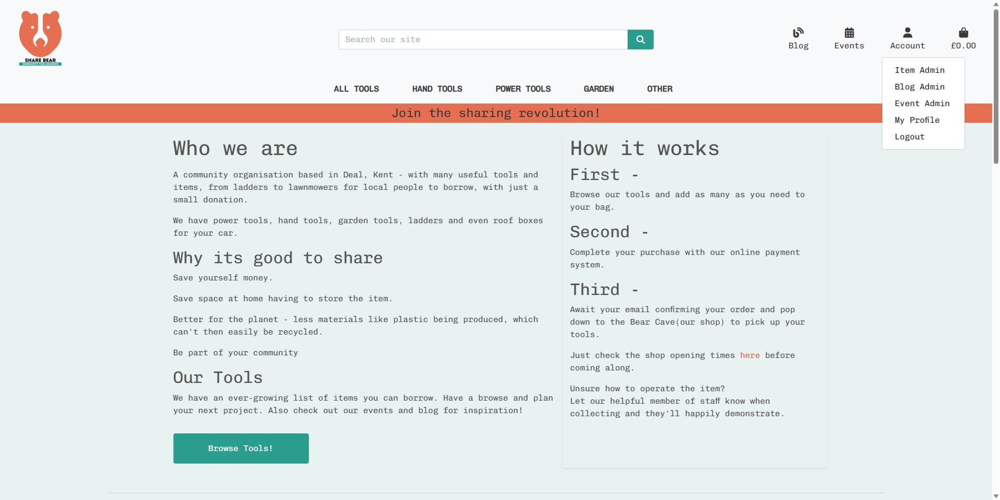
* View and click for further details the latest 4 blogs that have been written. This has the added benefit of the homepage dynamically updating every time a new blog is published.
* View and click for further details the latest 4 events that are coming up.
* The blog and events are filtered to remove any that don't include an image to ensure the homepage looks professional.
* Shop information listed with opening times and a google map.  

#### **Items App** ####

1. Item_list [C**R**UD]
* Choose from the main header the tools of a particular category.
* Use the sort by dropdown to sort the tools by price, name or category.
* See the total amount of tools available in that particular category
* Each tool shows the name, category, price, stock and if available.  
  If unavailable it will show a date when it becomes available again.  
- 
* Unlike an e-commerce site there will only be one of each item in most cases, or only a limited number.  For this reason I felt the stock amount should be an important feature.
    The items will be borrowed for a week long period, meaning after checkout the stock will be reduced by the quantity and the availableDate field updated with a date 7 days from purchase. All done automatically from the checkout_success view.
* If changes happen outside this process, such as an item being returned early, then a staff member can update the information easily from the Item Management page.

2. Item_detail [C**R**UD]
* After selecting an item it takes you to the detail page for it.  It contains further description details also.
* You can change the quantity you'd like to purchase, using the increment and decrement buttons.
* I've implemented JavaScript code to ensure that the decrement button is disabled to prevent the quantity going below 1.
* I've also implemented JavaScript code to disable the increment button to prevent the quantity going above the available 'stock' number.(see quantity_input_script.html)
* The options are either to select 'Keep Shopping' taking you back the item list or 'Add to Bag' .
* When adding to the bag a toast/message is rendered on screen confirming this was successful, along with an image of the whole bag, including items previously added.
* At this point the bag view checks to ensure the quantity of the item in the bag already and the additional quantity doesn't exceed the stock for that item.  If it does, the additional quantity isn't added to the bag and the user will receive a warning message.
- 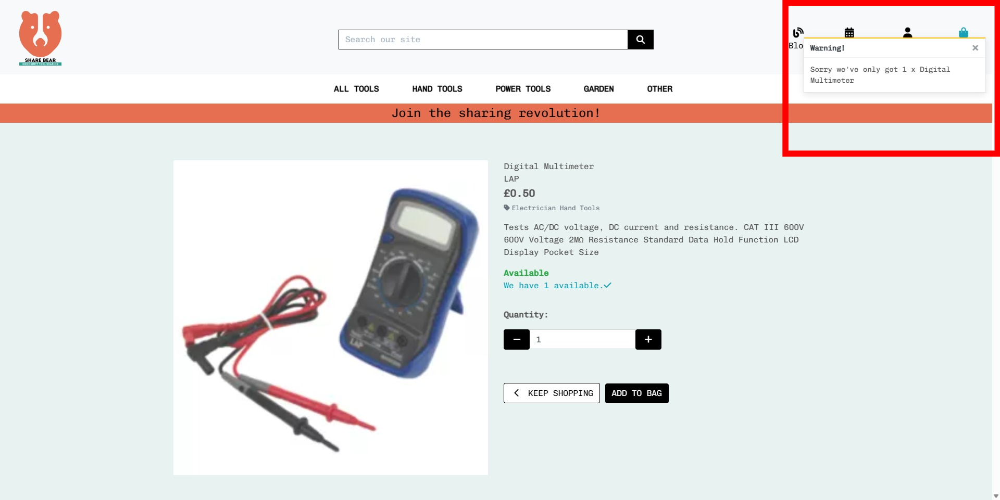

3. Add Item [**C**RUD]
* If an authenticated staff member is logged in they can add a new item, via the Item Management page.  Accessed from the Account dropdown.
* A simple form to complete the necessary fields. Category, Name, Description, Manufacturer, Price, Image url, Image, AvailableDate and Stock.
* Manufacturer, Image url, Image and AvailableDate aren't mandatory.
* Once completed and 'Add Item' button selected it adds a new item entry in the database, and is immediately available to be borrowed.
* If no image is selected then a default image is used.
- 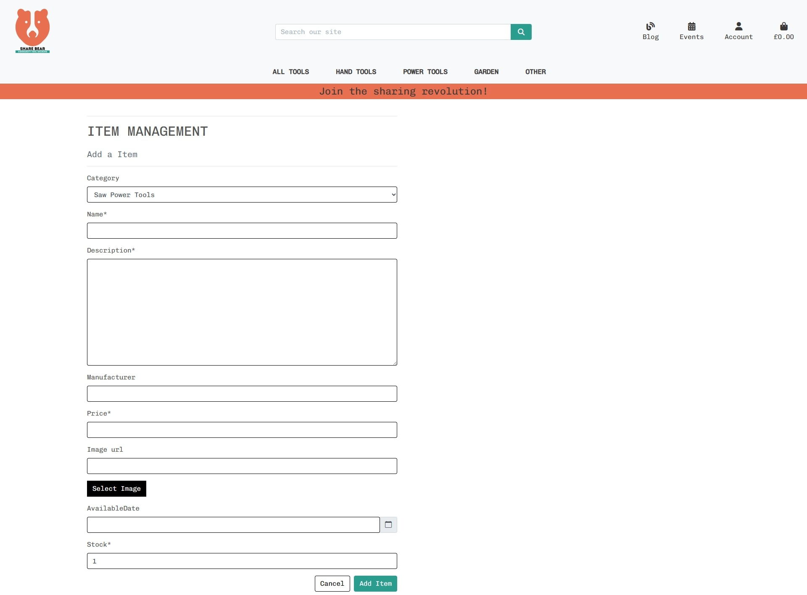

4. Edit Item [CR**U**D]
* If an authenticated staff member is logged in they can edit an item, via the edit link on the respective item's detail page or from the items card on the main item page.  
* The link is conditionally rendered based on the user being staff and logged in.
* The existing database information for the item is pre-filled in the fields.
* Easy to use and useful if someone needs to extend the time they've borrowed an item by pushing out the AvailableDate.
* Once completed and 'Update Item' button selected it update the database with the new information immediately.
- 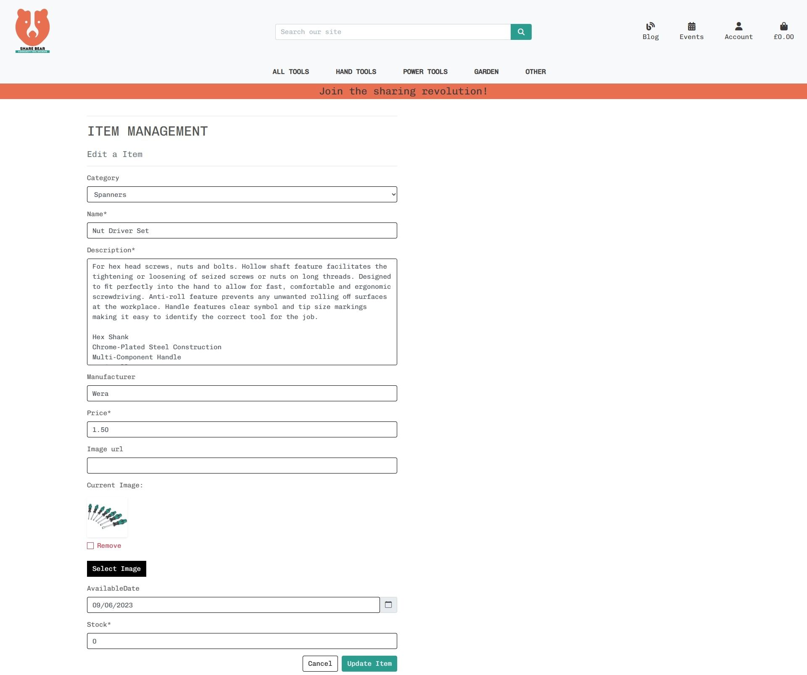

5. Delete Item [CRU**D**]
* If an authenticated staff member is logged in they can delete an item, via the delete link on the respective item's detail page or from the items card on the main item page.  
* The link is conditionally rendered based on the user being staff and logged in.
* As an extra precaution against deleting an item in error, I've added a modal pop-up for the user to confirm.
- 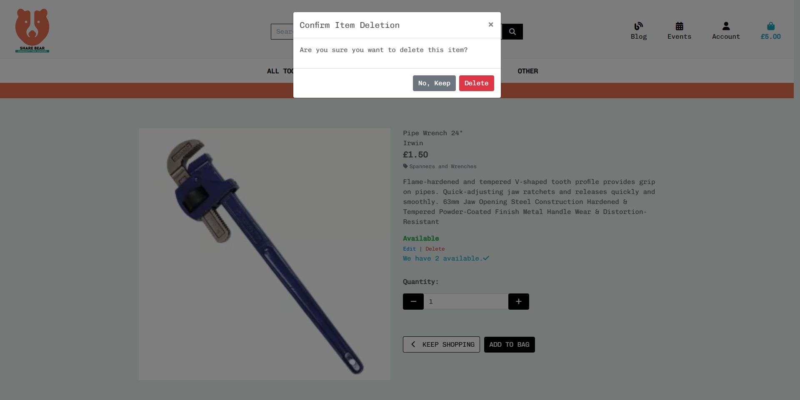  


#### **Blog App** ####

1. Blog List [C**R**UD]
* Here you can see a list of articles, sorted in date order so the latest is at the top.
* Includes a clickable title and button taking you to the full article.
- 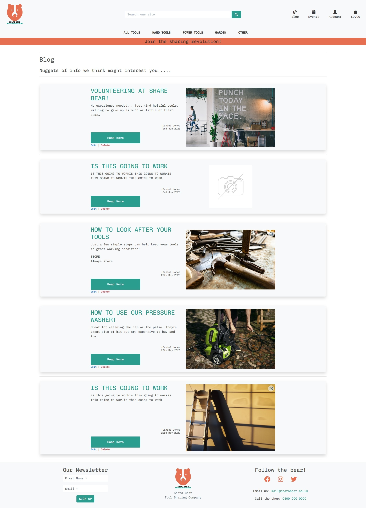  

2. Blog details [C**R**UD]
* Here you'll find the full article.
* A logged in staff user can select edit or delete from here.
* Delete button opens a modal to confirm cancellation.
* Back button to return to Blog List.
- 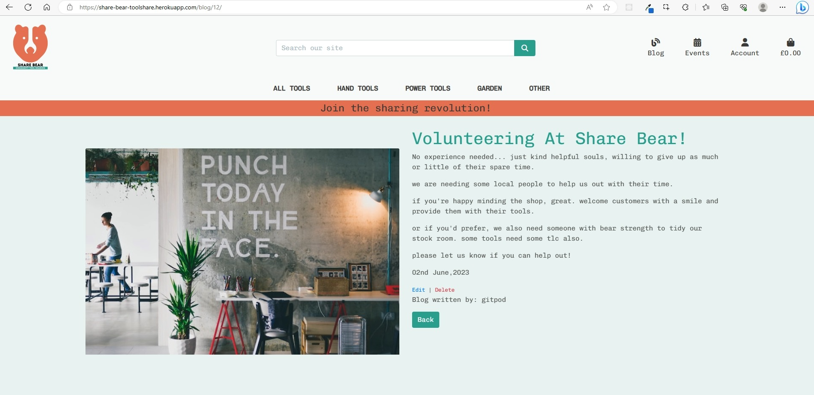  


3. Blog -  Add [**C**RUD]
* If an authenticated staff member is logged in they can add an article by selecting 'Blog Management' from the main navigation Account dropdown.
* A form is rendered allowing the staff member to add all necessary fields. Including Title, Body, and Image.
* Once the details are added and the 'Add Article' button is selected, the database is updated with the article.  The event is rendered on the article list page and the home page if one of the most recently published.
- 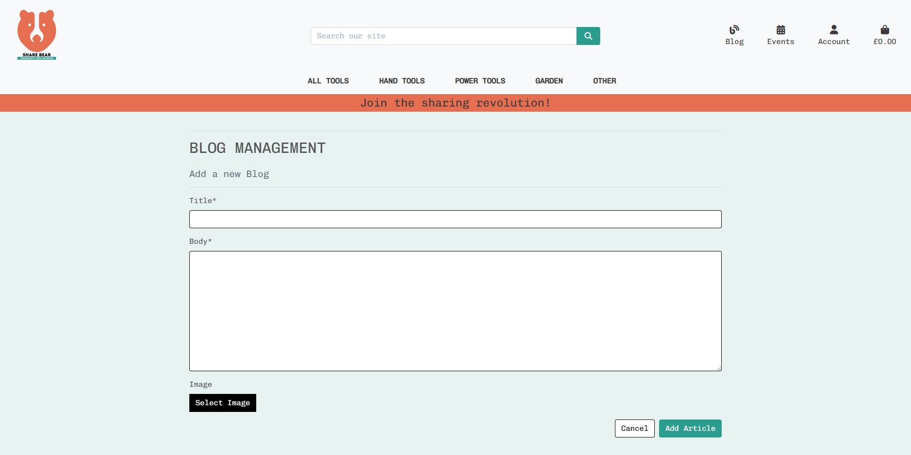

4. Edit Blog [CR**U**D]
* If an authenticated staff member is logged in they can edit an article, via the edit link on the respective article's detail page or from the article card on the main article page.
* The link is conditionally rendered based on the user being staff and logged in.
* The links take you to an edit blog form.
* The existing database information for the item is pre-filled in the fields.
* Once completed and 'Update the article' button selected it update the database with the new information immediately.
- 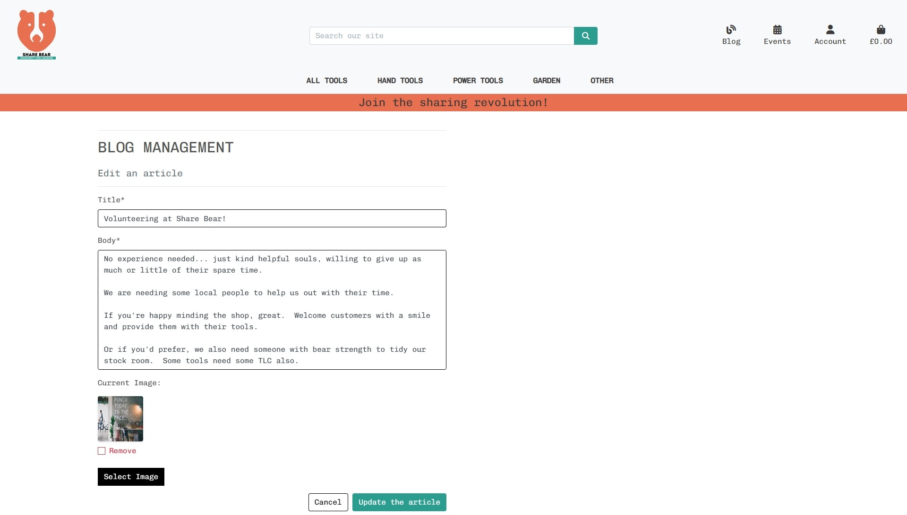

5. Delete Blog [CRU**D**]
* If an authenticated staff member is logged in they can delete an article, via the delete link on the respective article's detail page or from the article card on the main article detail page.  
* The link is conditionally rendered based on the user being staff and logged in.
* As an extra precaution against deleting an article in error, I've added a modal pop-up for the user to confirm.

#### **Event App** ####

1. Events List [C**R**UD]
* Here you can see a list of articles, sorted in date order so the latest is at the top.
* These will be events that are organised by Share Bear with the Share Bear ethos. Community minded and environmental.
* Includes a clickable title and button taking you to the full article.

2. Event details [C**R**UD]
* Here you'll find the full article containing details of the event.  Date, time and location.
* There is a facility to email the organiser from this page.  The organiser's name and email address is dynamically rendered.
* If the email link is clicked it opens up the users email client with the organisers email address populating the 'To:' field.

3. Event - Add Attendee [CR**U**D]
* The user can select that they're going to attend the event.  They'll be prompted to log in/sign up if not already. Then it sends them an email confirming the event details for the user to refer back to and adds the event to the users profile page.
* The event stores them as an attendee.  This would allow reminders to be sent near the event date.
* If the user is logged in and already registered as attending, the event detail page will render confirming this and offering a link to the profile page to cancel if necessary.
<div style="display: flex; justify-content: center;">
    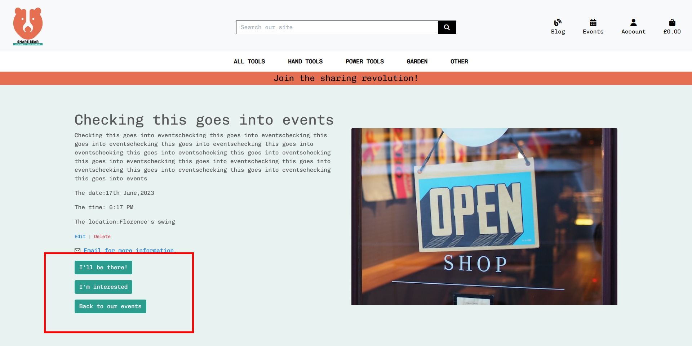
    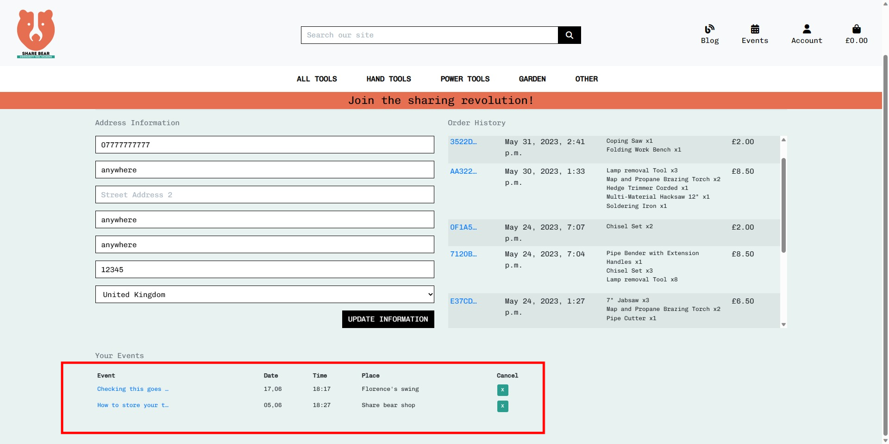
    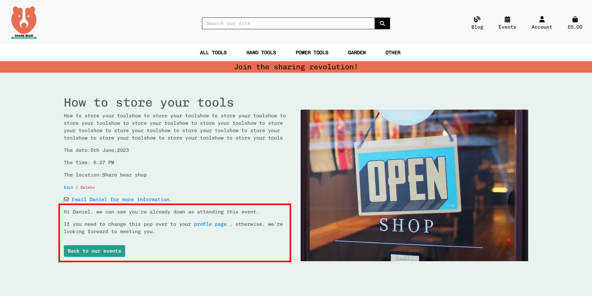
</div>

4. Event -  Add [**C**RUD]
* If an authenticated staff member is logged in they can add an event by selecting 'Event Management' from the main navigation Account dropdown.
* A form is rendered allowing the staff member to add all necessary fields. Including Title, Body, Date, Location, Image and from a dropdown, the organiser.
* Once the details are added and the 'Add Event' button is selected, the database is updated with the event.  The event is rendered on the event list page and the home page if one of the 4 most due the soonest.

5. Event - Edit [CR**U**D]
* If an authenticated staff member is logged in they can edit an event, via the edit link on the respective article's detail page or from the article card on the main article page.
* The link is conditionally rendered based on the user being staff and logged in.
* The link takes you to a an edit event form. The existing database information for the event is pre-filled in the fields.
* Once completed and 'Update the article' button selected it updates the database with the new information immediately.  
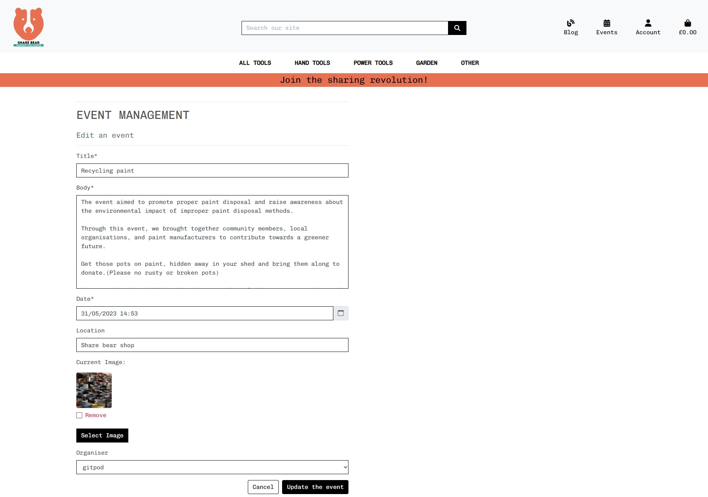

6. Event - Delete [CRU**D**]
* If an authenticated staff member is logged in they can delete an event, via the delete link on the respective event's detail page or from the article card on the main article detail page.   The link is conditionally rendered based on the user being staff and logged in.
* As an extra precaution against deleting an event in error, I've added a modal pop-up for the user to confirm.

#### **Newsletter App** ####

* As part of the footer, the newsletter form is available to sign-up to on the Home page, the article_list page and the blog_list page.  
* Simple form, taking first name and email with a sign-up button.
* Given the need for community evolvement and volunteering, I felt it necessary for regular updates for people interested in all things to do with Share Bear.
* The form with handled within the view it was submitted from.  The view checks if the email already exists in the Newsletter model and if so then the user is updated with a message. Otherwise the data is added to the Newsletter model.
* If the user is logged in, then the user details are captured too, as this could be useful data for targeted mailing.  
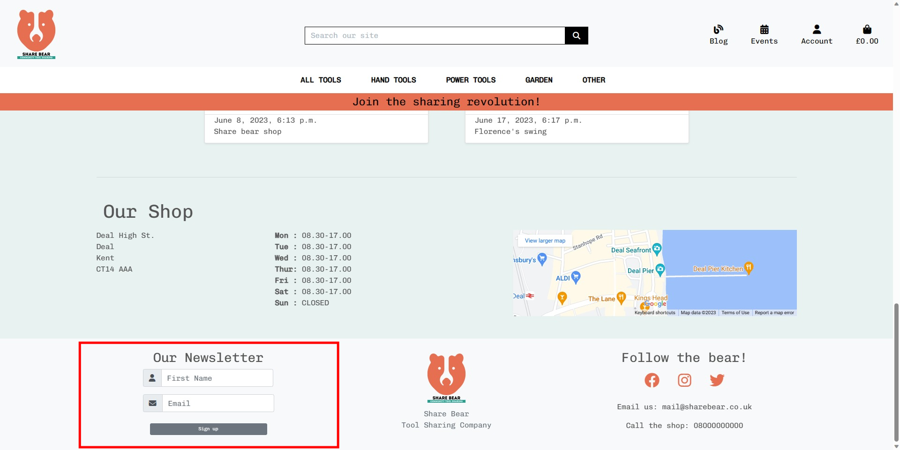


#### **Bag App** ####

* The user can either access the bag via the 'Go to Secure Checkout' button on the message toast when adding items or by selecting the bag icon on the top navigation bar.
* Items are added to a bag session. Stored to if the user leaves and returns to the site, the bag still has their items in it.
* The bag is displayed differently depending on screen size, with the small screens vertically stacking the items.
* The user can choose to remove the individual items and update the quantity.
* The increment button will disable once the stock amount has been reached for that item.
* The user can choose to 'keep shopping' or 'secure checkout'.  If they select 'Secure Checkout' this triggers the 'Checkout' App/view. 

#### **Checkout App** ####

1. Checkout
* An order form and order summary is rendered on screen.
* User has an option to 'Save details to their profile' by selecting a checkbox.
* To proceed with the purchase, the user will need to complete the form, including payment details and choose 'Complete Order'
* The payment request is made via Stripe.
* The bag session is stored and the order details updated on the database Order table.
* If the user chose to save the order details then the database is updated with the order linked to their profile.

2. Checkout Success
* With the payment complete, the detail of the order are confirmed with a thank you.
* Information about the items, order number, amount and the shop address is included.
* The order details are also stored within the profile section.

#### **User App** ####

* I used Django built in authentication management system allauth.
* This deals with all registration, logging in/out and password resetting.


###   Features to implement in the future

1. Newsletter
- I'd need to implement a data agreement that the user can agree to. 
- Means to unsubscribe to marketing and newsletters from within the profile page and emails that are sent.

2. Events
- An in-built mechanism to send event reminders to those that expressed an interest or said they'd attend.

3. Stock
- A booking system allowing a user to reserve items.  Maybe showing a calendar on the item detail page showing dates available.

4. Eventually a Vinted or Facebook Marketplace system, whereby users can arrange to borrow items directly from others.

5. The availableDate applied if stock is 0 is currently set as 7 days from the date the last item is taken.  If more than 1 item then there maybe a return due within that time but currently my system of tracking the stock doesn't handle this.

6. If necessary there are applications available to manage and track assets, which would provide a more comprehensive means to managing the stock and displaying availability to the user. Also allowing users to reserve items. eg. [myTurn](https://myturn.com).


---
## **TECHNOLOGIES USED** ##

### Languages

-   [HTML5](https://en.wikipedia.org/wiki/HTML5)
-   [CSS3](https://en.wikipedia.org/wiki/Cascading_Style_Sheets)
-   [Javascript](https://en.wikipedia.org/wiki/JavaScript)
-   [Python](https://www.python.org/)


### Frameworks, Libraries & Programs

- [Git](https://git-scm.com/)
    - Version control.
- [GitHub](https://github.com/)
    - For storing code and deploying the site.
- [Gitpod](https://www.gitpod.io/)
    - Used for building and editing my code.
- [Django](https://www.djangoproject.com/)
    - A python based framework that was used to develop the site.
- [Bootstrap](https://getbootstrap.com/)
    - For help designing the html templates.
- [Google Fonts](https://fonts.google.com/)
    - Used to style the website's logo.
- [Font Awesome](https://fontawesome.com/)
    - Used to obtain the icons used.
- [Google Developer Tools](https://developers.google.com/web/tools/chrome-devtools)
    - Used to help fix problem areas and identify bugs.
- [AWS S3 Console](https://s3.console.aws.amazon.com/s3/home)
    - Used to store static files and images.
- [Favicon.io](https://favicon.io/)
    - Used to generate the site's favicon.
- [SQlite](https://www.sqlite.org/index.html)
    - Used when performing unit tests.
- [ElephantSQL](https://www.elephantsql.com/)
    - PostgreSQL database
- [Lucidchart](https://www.lucidchart.com//)
    - To draw out the database schema.
- [Trello](https://www.trello.com//)
    - List making application to track progress. 
- [Balsamiq](https://balsamiq.com/)
    - To create the wireframes.
- [W3C Markup Validation Service](https://validator.w3.org/) 
    - Used to validate HTML code.
- [W3C CSS Validation Service](https://jigsaw.w3.org/css-validator/#validate_by_input)
    - Used to validate CSS code.
- [Pep8](http://pep8online.com/)
    - Used to validate Python code.
- [JSHint](https://jshint.com/)
    - Used to validate JS code.
- [Tinyjpg](https://tinyjpg.com/)
    - Used to compress images.
- [Heroku](https://www.heroku.com/)
    - To deploy the project.

---
## Testing 

Testing and results can be found [here](TESTING.md)

---
## **DEPLOYMENT** ##

Please see the separate deployment file which you can read here: [⮫DEPLOYMENT.md](DEPLOYMENT.md)

---

### <ins>HOSTING</ins>

The site is hosted on [Heroku](https://share-bear-toolshare.herokuapp.com/).


### Making a Local Clone

    To clone my project you must;

    1. Sign in to Github and go to my [repository](https://github.com/nddpj00/toolshare)
    2. Above the list of files click the green ‘code’ button.
    3. This will bring up a few options as to how you would like to clone. You can select HTTPS, SSH or Github CLI, then click the clipboard icon to copy the URL.
    4. Open git bash
    5. Type ‘git clone’ and then paste the URL you copied. Press Enter.

    For more information on cloning check out the github documentation [here](https://docs.github.com/en/repositories/creating-and-managing-repositories/cloning-a-repository)

---
## **CREDITS** ##

### Content

-  The structure of the site, bootstrap grid for the item pages and the payment section was heavily influenced by the Boutique Ado walk-through which is part of the course I'm undertaking.
-  All remaining content was written by the developer.


### Media

-   [Unsplash]( https://unsplash.com/)All photos used came from unsplash.  
-   [Font-Awesome](https://fontawesome.com/)  icons.
-   [Screwfix](https://screwfix.com) for the tool images.

### Acknowledgements

-   My Mentor for continuous helpful feedback.

-   EKC course facilitator, Rachel Furlong for introducing me to many new concepts and software and lots of great advice.

-   All those clever people at the Code Institute tutor support that pointed me in the right direction.