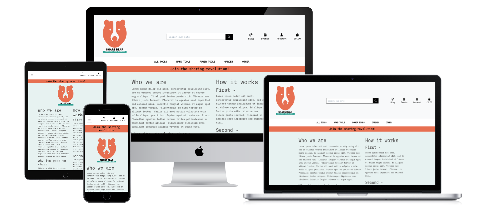
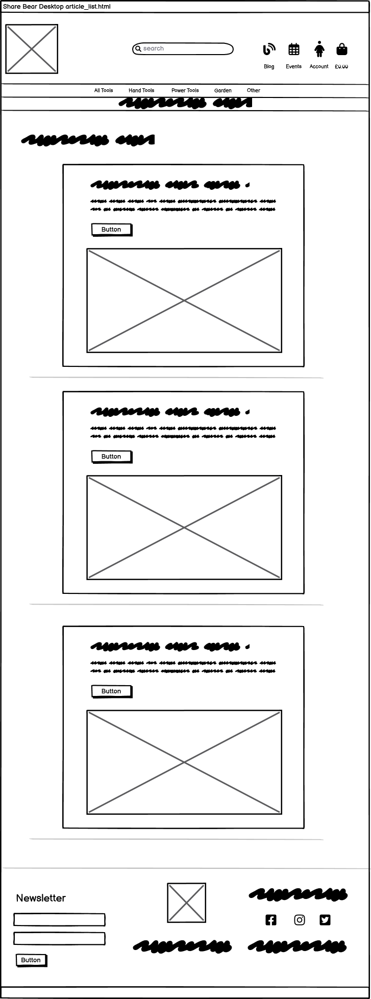
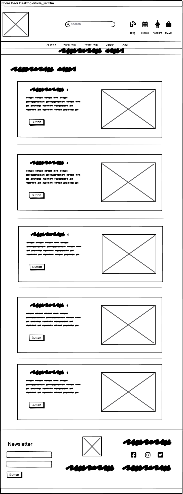
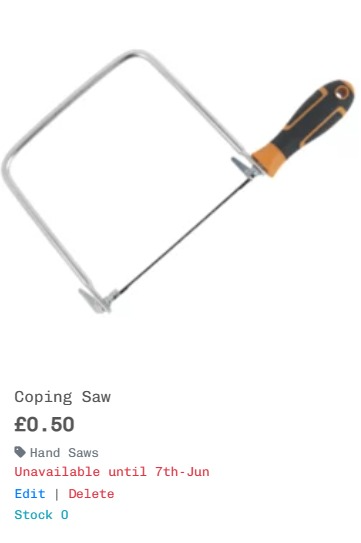

# [Share Bear - Community Tool Sharing ](https://share-bear-toolshare.herokuapp.com/)



[View the live project here.](https://share-bear-toolshare.herokuapp.com/)

I'm what you might call an enthusiastic DIYer.  I have no expertise in any building maintenance or repair and really have no affinity with it either....  but always feel I should *go-it-a-go* (much to the exasperation of my long-suffering wife).  So I'm often embarking on a new project to repair or update a part of our aging victorian house, of which it so often needs.

After much researching on how to complete the job I often discover that to do it properly, which at this point at least is my intention, I need to purchase a new, shiny tool.  The tool usually seems like a good investment, after all, I'm saving money by doing the job myself right.  The problem is , if I take a stroll down to my shed right now and peer in, I've got shelves and shelves of tools that I've brought for previous jobs and are practically untouched or used only once or twice , literally gathering dust and housing spiders.

You can hire tools of course, but looking online its not a lot less than buying, except for JCBs and other large machinery.

Looking out from my house, across the gardens up and down my street I can see every one has a shed and I can guarantee most include garden tools, lawnmowers , ladders and a vareity of other barely used tools and machinery.... slowly rusting away and rarely used.  Surely it would make better sense to share these tools.  Financially, environmentally and to save space too.

My idea is Share Bear. A community based organisation, which means its for the benefit of local people to make use of it but also to contribute, volunteer and run it.

I'd love to expand on the idea and set up a project that would work a little like Vinted or Facebook Marketplace, where users deal with each other directly, but for sharing tools.. in fact sharing anything really. Why stop at tools!  However, that format I quickly realized  was out of my scope as regards my current knowledge of Django and time, so opted for the below approach - 

1. People can browse the tool catalogue and borrow as many tools as they need for a week at a time.  There is a nominal price on each product to cover maintenance and upkeep of the tools.  Plus this gives me the opportunity to fulfil the 'online payment processing' criteria requirement, needed to complete my Diploma.

2. After completing the payment, the user will need to come to the utopian space that is the Share Bear shop, whereby they can collect their items and receive instruction or demonstrations on how to use it.  And if they have time,  hang for a while with one of the fine volunteers, sharing a cup of good, responsibly sourced coffee!

3. One week later, return the items as clean as when taken. Feeling just a little smug that they saved money, saved space and saved the environment... well ok, only a little, but it all helps.

Why is this such a good idea. 

- Financial - Everyone is generally harder up these days, what with the increases in the cost of living.  This is an opportunity to save money while maintaining/improving your assets ie house.
- Environmental - The average drill gets used for 13 minutes in its lifetime.  Thats a lot of drills being made and not getting used, to then end up as scrap or waste.
- Space - Keeps that space in the shed for whats important.  Getting those bikes in and out easily maybe. Or playing darts.

---

## **USER EXPERIENCE (UX)** ##

The project was created in order to fulfil the criteria of the L5 Diploma in Web Application Development that I'm completing. This is for Unit 4: Full Stack Frameworks with Django.

The unit aims to provide knowledge and skills needed to build a Full Stack web application. Topics include the use of frameworks, API's, persistent storage, user authentication and e-commerce functionality.


### User Stories

"**_As a user, I would like to_** _____________________________"

:heavy_check_mark: *denotes items that have been successfully implemented*

1. Viewing and Navigating the site
- :heavy_check_mark: *view* all the items in one place.
- :heavy_check_mark: *view* individual items for further details such as price,description,availability and an image
- :heavy_check_mark: *view* the items by specific type or category. ie Garden tools.
- :heavy_check_mark: *view* the items by specific order. ie sorting by price.
- :heavy_check_mark: *view* the items that are available.
- :heavy_check_mark: *view* an items available date if currently unavailable.
- :heavy_check_mark: *view* how much the individual items are and a running total of all items chosen.
- :heavy_check_mark: *view* items in a bag to be purchased.
- :heavy_check_mark: *view* a selection of tools that fit my search parameters. ie name or category.
- :heavy_check_mark: *view* articles about ways to help save the environment, money or space.
- :heavy_check_mark: *view* more information about community events that taking place to help save the environment, money or space.


2. Registration and User Accounts
- :heavy_check_mark: *Register* for an account and view my profile.
- :heavy_check_mark: Easily log in and logout of my *User Account*.
- :heavy_check_mark: Easily recover my password for my *User Account*.
- :heavy_check_mark: Receive an email confirmation after *registering*.
- :heavy_check_mark: have access to my personalized *User* profile address and phone number.
- :heavy_check_mark: have access to my personalized *User* profile to see my previous orders.
- :heavy_check_mark: have access to my personalized *User* profile to see the events I'm attending.


3. Community information and events
- :heavy_check_mark: receive information via email about *events* Share Bear are organizing.
- :heavy_check_mark: receive regular *information* via email about Share Bear in general.


4. Online payment process
- :heavy_check_mark: view clearly the items I'm going to *pay* for.
- :heavy_check_mark: safely complete a *payment* for the items, with prompts and confirmation.
- :heavy_check_mark: receive confirmation the *payment* was successful.
- :heavy_check_mark: receive confirmation of the order on screen with details about the next steps.
- :heavy_check_mark: receive confirmation of the order via email with details about the next steps.


"**_As a user and staff member, I would like to_** _____________________________"

1. Add, Edit and Delete items.
- :heavy_check_mark: easily *add* new items available to borrow.
- :heavy_check_mark: easily *edit* items information. changing stock, availability or details
- :heavy_check_mark: easily *delete* items if no longer an item Share Bear offers.

2. Add, Edit and Delete Blogs.
- :heavy_check_mark: easily *add* new blogs. Information and images
- :heavy_check_mark: easily *edit* blogs to update information and images.
- :heavy_check_mark: easily *delete* blogs that are out-of-date or no longer of interest.

3. Add, Edit and Delete Events.
- :heavy_check_mark: easily *add* new Events. Information, image, date, location and organiser.
- :heavy_check_mark: easily *edit* events to update current information.
- :heavy_check_mark: easily *delete* old or cancelled events.


## Design  

#### Colour Scheme

Though the site has E-commerce functionality, I felt it should have a less sterile feel than most do, but still showcasing the items.  Most ecommerce sites keep the colours neutral , with white or off-white backgrounds, but i wanted to offer up a friendlier tone.
-  `#e76f51` (**Burnt Sienna**)
-  `#e8f2f1` (**Light Blue**)
-  `#2a9d8f` (**Dark Green**)

#### Typography

- I used [Google Fonts](https://fonts.google.com/) for my application. 

-Throughout the site I used 'Chivo Mono' for the text. With a grey colour. 

- [Chivo Mono](https://fonts.google.com/specimen/Chivo+Mono)


#### Icons

- [Font Awesome 6.3.0](https://fontawesome.com/)
    - These where used throughout the site. including  the navigation icons, the increment/decrement icons and social icons.


### WIREFRAMES 

Please click on the individual Apps to see all wireframes.

- [Wireframes Home App](wireframes/home)


- [Wireframes Items App](wireframes/items)


- [Wireframes Profile App](wireframes/profile)


- [Wireframes Events](wireframes/events)


- [Wireframes Blog](wireframes/blog)


- [Wireframes Bag](wireframes/bag)


- [Wireframes Checkout](wireframes/checkout)


- [Wireframes Checkout Success](wireframes/checkout_success)


---
## **THE DATABASE** ##

I chose to use PostgreSQL, a relational database system for my app as I felt there was going to be clear defined relationships between the tables and the data therein. I felt an RDBMS would be well suited to query and manage the content for my needs.

The relationships between the models mostly stem from either the User or the Items.  
The schema allows for the following:
-  Users profiles to access the allauth user information.
-  Orders to be linked to an individual User and display on their profile page.
-  Order items (OrderLineItem) to be linked to both Order and Item.
-  Items to be linked to their particular Categories for sorting and display purposes.
-  Blogs/Articles author linked to a User.
-  Events organiser to be linked to a User.
-  Newsletter subscribers linked to existing Users.


**User**
```
id: <BigAutoField>
username : <Charfield>
email: <EmailField>
```

**UserProfile**
```
id: <BigAutoField>
user: <OneToOneField>
default_phone_number: <CharField>
default_street_address1: <CharField>
default_street_address2: <CharField>
default_town_or_city: <CharField>
default_county: <CharField>
default_postcode: <CharField>
default_country: <CountryField>
```

**Order**
```
id: <BigAutoField>
order_number: <CharField>
user_profile: <ForeignKey>
full_name: <CharField>
email: <EmailField>
phone_number: <CharField>
country: <CountryField>
postcode: <CharField>
town_or_city: <CharField>
street_address1: <CharField>
street_address2: <CharField>
county: <CharField>
date: <DateTimeField>
order_total: <DecimalField>
original_bag: <TextField>
stripe_pid: <CharField>

```

**OrderLineItem**
```
id: <BigAutoField>
order: <ForeignKey>
item: <ForeignKey>
quantity: <IntegerField>
lineitem_total: <DecimalField>

```

**Category**
```
id: <BigAutoField>
name: <CharField>
friendly_name: <CharField>

```

**Item**
```
id: <BigAutoField>
category: <ForeignKey>
name: <CharField>
description: <TextField>
manufacturer: <CharField>
price: <DecimalField>
image_url: <URLField>
image: <ImageField>
availableDate: <DateField>
stock: <PositiveIntegerField>

```

**Article**
```
id: <BigAutoField>
title: <CharField>
slug: <SlugField>
body: <TextField>
date: <DateTimeField>
thumb: <ImageField>
author: <ForeignKey>

```

**Event**
```
id: <BigAutoField>
organiser: <ForeignKey>
title: <CharField>
slug: <SlugField>
body: <TextField>
date: <DateTimeField>
attendees: <ManyToManyField>
interested: <ManyToManyField>
location: <CharField>
thumb: <ImageField>

```

**Newsletter**
```
id: <BigAutoField>
first_name: <CharField>
email: <EmailField>
is_registered_already: <ForeignKey>

```


---
## **FEATURES** ##

### **Site Features** ###

1. Responsive on all device sizes.

2. Easily navigate to all other parts of the site, regardless of where you are.

3. Visability of bag total on all pages.


### **App Features** ###

#### **Home App** ####

* Clear responsive navigation that can take you to the items, blogs, events or profile pages.
* Information about the purpose of the organisaion and a button for quick access to the tools available.
* Information of the process of 'borrowing' items.
* Search the site via the search bar.
* View and click for further details the latest 4 blogs that have been written. This has the added benefit of the homepage dynamically updating every time a new blog is published.
* View and click for further details the latest 4 events that are coming up.
* Shop information listed with opening times and a google map.  

#### **Items App** ####

* Choose from the main header the tools of a particular category.
* Use the sort by dropdown to sort the tools by price, name or category.
* See the total amount of tools available in that particular category
* For each tool you see view the name, category, price, stock and if available.  If unavailable a date will show a date when it becomes available again. 
* 


###   Features to implement in the future

1. User login
- This would allow others to use it for their purpose with *their* favourite recipes.
- Users able to delete their own recipes and option to view only their recipes.
- Would ensure the security of the App. Preventing users deleting others recipes.

2. Filter
- Users able to filter recipes by more than just food group.  Cuisine, Healthy or family friendly.  This is the reason I've added 'Cuisine' information on the database but as yet, not used.

3. Search
- Users to be able to search a specific ingredient.  

---
## **TECHNOLOGIES USED** ##

### Languages

-   [HTML5](https://en.wikipedia.org/wiki/HTML5)
-   [CSS3](https://en.wikipedia.org/wiki/Cascading_Style_Sheets)
-   [Javascript](https://en.wikipedia.org/wiki/JavaScript)
-   [Python](https://www.python.org/)


### Frameworks, Libraries & Programs

1. [Flask 2.2.3](https://flask.palletsprojects.com/en/2.2.x/)
    - Micro web framework use for the main build of the database-backed app.
1.  [Jinja](https://jinja.palletsprojects.com/en/3.1.x/)
    - Templating engine used to pass data to render final document. Used to write code similar to Python within the html documents.
1.  [SQLAlchemy 1.4.46](https://www.sqlalchemy.org/)
    - Toolkit used to allow use of Python language to complete SQL queries.
1.  [Psycopg2 2.9.5](https://pypi.org/project/psycopg2/)
    - PostgresSQL database adapter for Python.
1.  [ElephantSQL](https://www.elephantsql.com/)
    - To host my PostgreSQL database
1.  [Heroku-22](https://www.heroku.com/)
    - As the hosting platform for the App.
1.  [Bootstrap 5.3.0:](https://getbootstrap.com/docs/5.0/)
    - Bootstrap was used to assist with the responsiveness and styling of the website.
1.  [GitHub:](https://github.com/)
    - GitHub is used to store the project's code after being pushed from Git.
1.  [Balsamiq:](https://balsamiq.com/)
    - Balsamiq was used to create the initial wireframes during the design process.
1.  [BrowserStack:](https://www.browserstack.com/docs/)
    - BrowserStack allowed manual testing of the site of all different browsers and devices. 
1.  [Unsplash:](https://unsplash.com/)
    - Unsplash provided a free resource for the photos used on the site.
1.  [Tinypng:](https://tinypng.com/)
    - Tinypng was used to compress the photos to improve site load times.

---
### **VALIDATORS** ##

-  W3C Markup Validator complete without errors except for the Jinja syntax.


-   W3C CSS Validator complete without errors.
  

-   Code Institute Python Linter  showing 2 errors. E501 line too long.  I attempted to break up the line and indent on the line below but felt this only made it less clear.  


-   JSHint to Check Javascript. 2 Warnings about using 'let' of which I'm happy to ignore.


-   Lighthouse Overall Performance.
- Accessibility 98
- Performance 98
- Best Practices 83
- SEO 90  


---
## **TESTING** ##

### Manual Vs Automated Testing

- I opted to **manually** test my site.  The reasons are -  

    1. As the sole developer I can quickly carry out tests as I go and can obtain immediate results from the test.
    2. As the main purpose of the site is to learn about Back End Development, show understanding and gain a qualification; and won't need to be maintained in the long term, I felt the time it would take to build an automated testing process was unnecessary on this occasion.  In a real-world situation, the use of a test framework, such as Jest would be invaluable to ensure the continuous integrity of the site.
    3. UX testing. Important to the overall usability of the site and can only be carried out via manual testing. Automated testing lacks human observation and cognitive abilities.

- Reasons why I would use Automated Testing in the future for other projects.

    1. Larger scale site or application that may have an increased amount of functionality and code. Manual testing would take too long.
    2. Working in a team. Possibly no one person with in-depth knowledge of how the whole site should work and perform. Automated tests would allow anyone to run them.
    3. Continual code added to the site. Automated tests can be run after every addition, ensuring no disruption to the existing code.
    4. Higher accuracy. Important if the site is in the public domain and linked to an organization. To avoid deprecation of the 'brand' due to a poor website.
    5. Time. Though they take longer to set up initially, having a bespoke automated testing process will save time in the long run, due to how frequently they need to be run when maintaining and improving the site.


### Manual Test process  

  - The Test  
1. All navbar links work.
1. Home/Category page loads a 'Random recipe' of the correct food category. Check all 5.
1. All accordions work as expected across all 5 category HTML pages.
1. 'Add recipe' page opens with form to complete and all fields work as expected
1. 'Add recipe' button adds to the database and user is directed to the correct relevant recipe page, with feedback confirming the recipe has been added.
1. Edit button opens the edit_recipe page with form pre-populated with existing information.
1. 'Save Changes' button updates database with the changes made and user is directed to the correct, relevant page, with feedback confirming the recipe has been updated.
1. Delete button produces a modal to confirm user wants to proceed. If selects ok the user receives feedback confirming the deletion.
1. All pages work on different size screens, different browsers and devices

### Outcomes

 

I used a programme called BrowserStack to perform the tests. This is software provided as part of the course, included in the Student Developer pack.  This software allows you to load your site on a live environment on each device and browser.

The application recommended that 1 x high-end, 1 x low-end device and a tablet is tested for each main manufacturer of smart devices.  I tested Apple,Samsung and Google devices of differing size.  

Also, I've tested the site on a broad cross-section of browsers.  Chrome, Edge, Safari, Firefox and Opera.

The site performed well across all devices and browsers. All links worked as expected.  Appearance and layout looked good on all devices too.


A small selection of screenshots showing the cross-browser testing.  
Windows 11  
   
Mac Big Sur 14.1  
   
Apple Iphone 14  
  
Samsung S21 Ultra  
  
Apple Iphone SE 2022   
  
Apple iPad Pro 11  
  

---
## **BUGS** ##
1. If a user incorrectly input 60mins or over in the minute field for the cook time a DataError was produced.
    
1. When editing a recipe the cook time wasn't pre-populating, remaining empty.
1. If user clicks on 'Get random recipe' button, though it worked, the variable stored the recipe.  Meaning if the user clicked it over & over again it would show the same recipe. 
1.  When deploying my original app I ran in to a problem with the database.  It wasn't creating the database and linking to the app.  After many hours trying to resolve I decided to copy the code on to a new workspace and re-attempted the deployment.  Unfortunately my 'commits' will be linked to that original Repo ["mealplanner.2"](https://github.com/nddpj00/mealplanner.2)

## Fixes
1. The dataerror was due to using the incorrect datatype I believe.  In the form I changed the type to "time" and this resolved it immediately.
1. The data stored in the database was in the incorrect format.  By added 0 before the value on the html resolved this. ie value="0{{ recipe.cook_time }}" .
1. I added some Javascript to reload the page on the 'close' button to allow a new recipe to be set as random.
1. New workspace is this one and the deployment was successful.


### Known Bugs
No known bugs

---
## **DEPLOYMENT** ##

Deployment of the site was achieved by following the steps below :

- Create a managed database with [ElephantSQL](https://www.elephantsql.com/).
- Created a requirements.txt file by typing "pip3 freeze --local > requirements.txt" in the terminal which tells Heroku what dependencies are required.
- Created a Procfile in the root directory of my project and inside the file added the following command; web: python run.py
- Open __init__.py file and added an if statement before the line setting the SLQALCHEMY_DATABASE_URI and, in the else, set the value to reference a new variable, DATABASE_URL.
- To ensure that SQLAlchemy can read my external database, the URL needs to start with “postgresql://”, to do this I made an addition to the else statement from the previous step to adjust the DATABASE_URL in case it starts with postgres://:
- Save, add, commit and push to Github.
- Logged in to Heroku and selected "Create New App".
- Selected the input field "App Name" and gave app a unique name using dashes instead of spaces.
- Selected the region closest to my location.
- Clicked "Create App".
- Selected "Settings" from the Heroku App menu.
- Copy database URL from ElephantSQL.
- On Heroku, add a Config Var called DATABASE_URL and paste the ElephantSQL database URL in the value, then click Add.
- Add each of your other environment variables except DEVELOPMENT and DB_URL from the env.py file as a Config Var
- Selected "Deploy" from the Heroku App menu.
- Scrolled down the page and selected "Enable Automatic Deployment".
- Selected Master Branch under "Branch Selected".
- Clicked "Deploy Branch"
- Next I needed to add my tables to my database. Click 'More' and select 'Run console'
- Type python3 into the console and click Run
- input in terminal - from mealplanner import db - db.create_all() - exit()
-'Open app' will then open my app.

### <ins>HOSTING</ins>

The site is hosted on [Heroku](https://mealplanner-2.herokuapp.com/).


### Making a Local Clone

- Navigate to my GitHub [GitHub Repository](https://github.com/nddpj00/balanced-diet-menu-finder).
- Click the "Code" button next to the Green Gitpod button.
- Either, download the zip file or clone the repo using gh repo clone nddpj00/balanced-diet-menu-finder in the terminal.
- Install the modules listed in the requirements.txt file using "python -m pip -r requirements.txt" in the terminal.
- Create an env.py file in your application folder and add the following:

    ```
    import os

    os.environ.setdefault("IP", "0.0.0.0")
    os.environ.setdefault("PORT", "5000")
    os.environ.setdefault("SECRET_KEY", "********")
    os.environ.setdefault("DEBUG", "False")
    os.environ.setdefault("DEVELOPMENT", "True")
    os.environ.setdefault("DB_URL", "postgresql:///mealplanner")
    ```

  You will need to update the above with  your own SECRET_KEY and YOUR ROOT info.

- The app can now be run locally by typing python run.py in the terminal and will be available in your browser using the address "http://localhost:5000".

---
## **CREDITS** ##


### Content

-  Tim Nelson from Code Institute for his walkthroughs of Thorin & Co and Taskmanager. These were a great resource when putting my app together and creating the databases.
-  I took inspiration from the layout and features also contained in Tim Nelson's readme for his [2BN-Desserts Repo](https://github.com/TravelTimN/ci-milestone04-dcd/blob/main/README.md)
-  Anna Greaves from Code Institute for her instructions on deploying the app.
-  All remaining content was written by the developer.


### Media

-   [Unsplash]( https://unsplash.com/)All photos used came from unsplash.  
-   [Font-Awesome](https://fontawesome.com/)  icons.

### Acknowledgements

-   My Mentor for continuous helpful feedback.

-   EKC course facilitator, Rachel Furlong for introducing me to many new concepts and software and lots of great advice.

-   All those clever people at the Code Institute tutor support that pointed me in the right direction.