## Validators
- HTML
    - No errors were returned when passing through the official [W3C validator](https://validator.w3.org)

    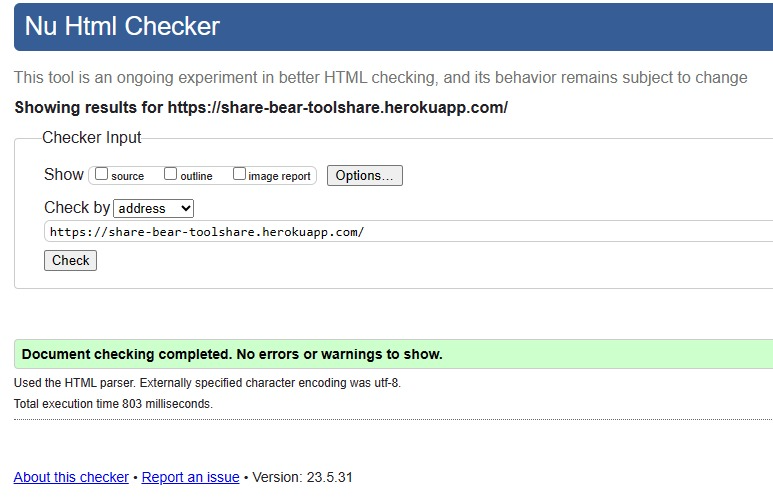
    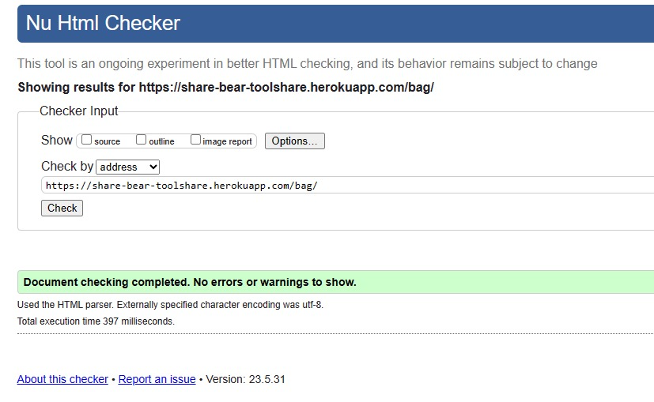
    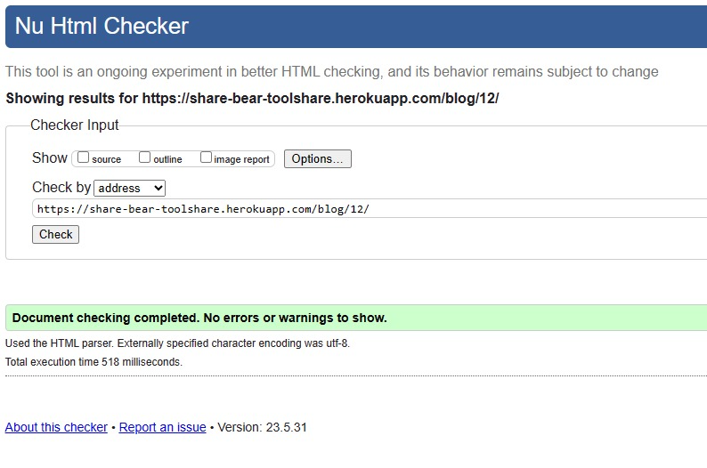
    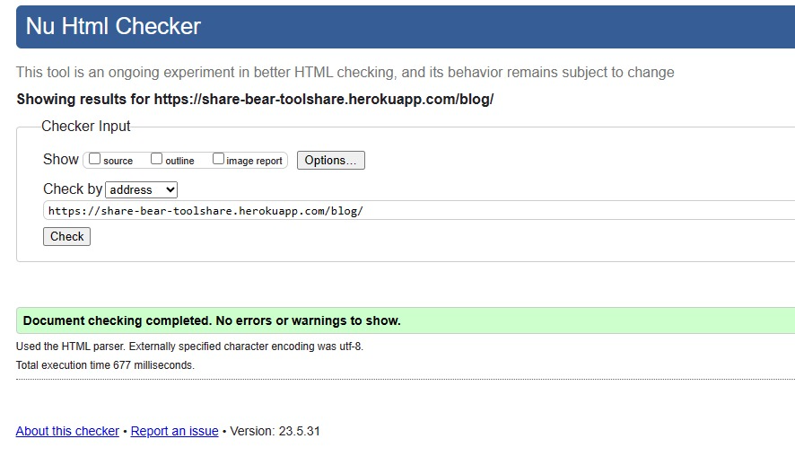
    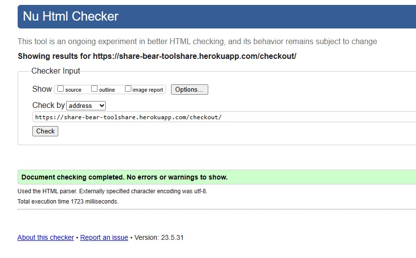

  
 

    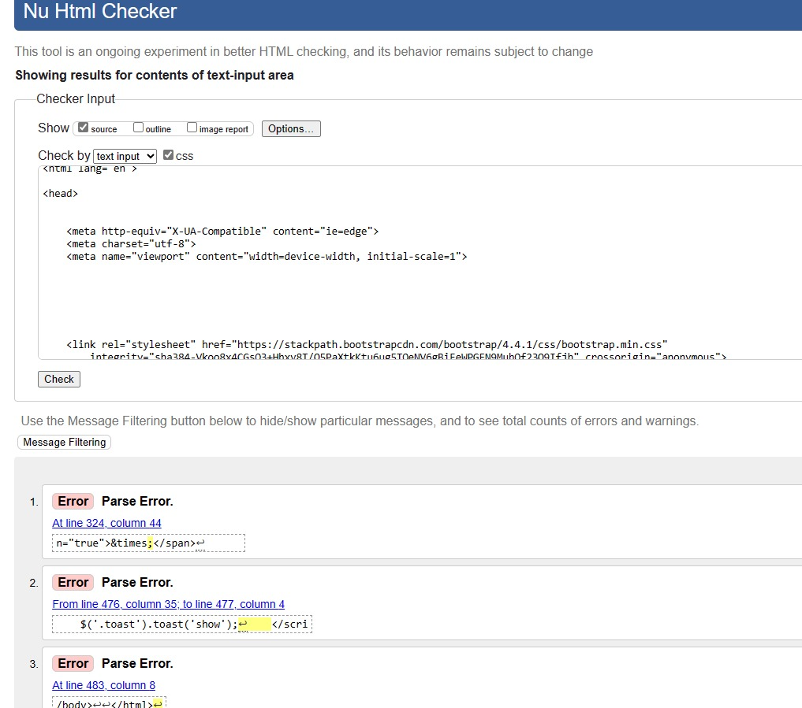
    
    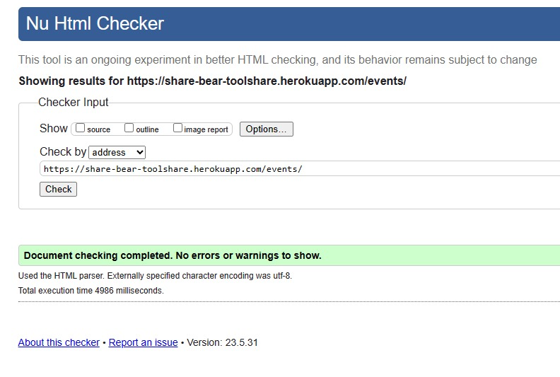
    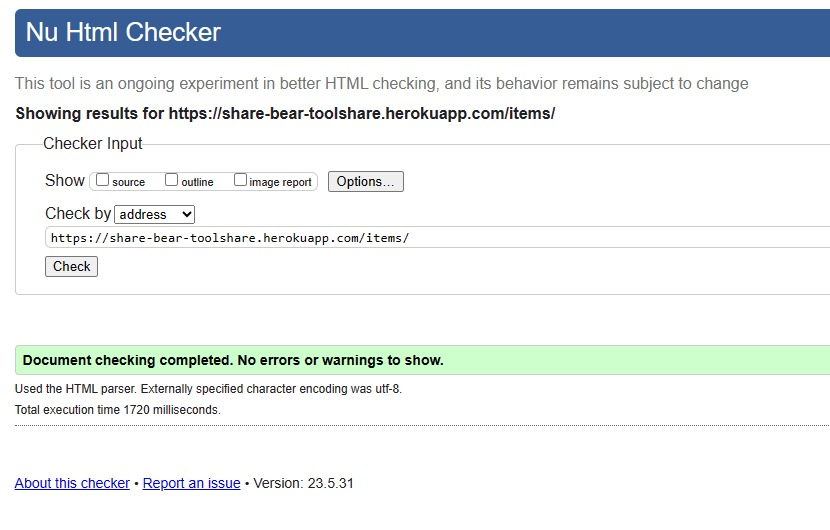
    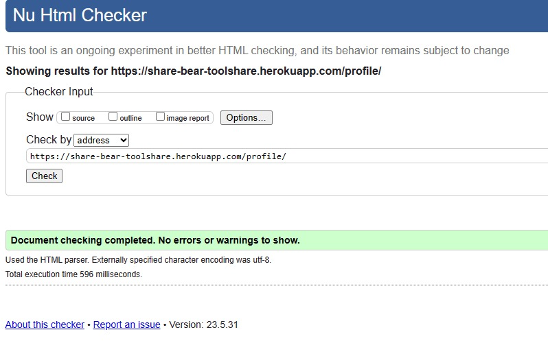

 
- CSS 
     - No errors were found when passing through the official [(Jigsaw) validator](https://jigsaw.w3.org/css-validator)
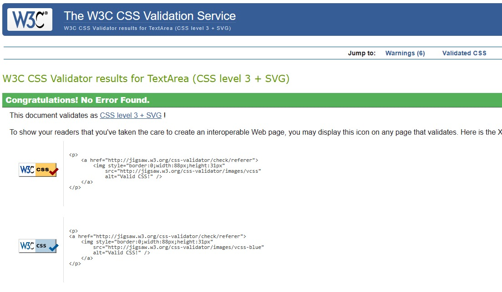
- JavaScript
    - No errors were found when passing through [Jshint](https://jshint.com/)

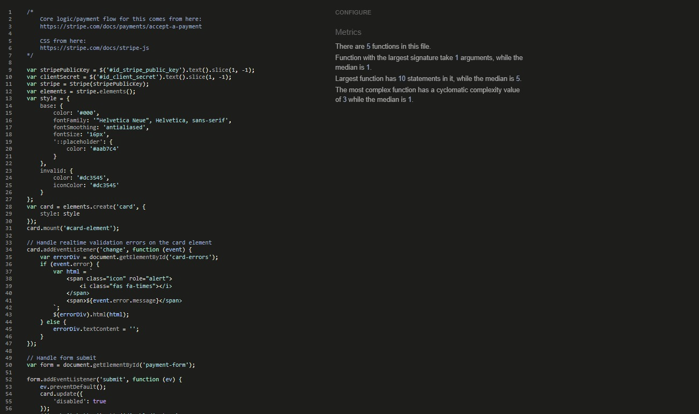

- Python
    -  [CI PEP8 Linter](https://pep8ci.herokuapp.com/#/)
    Only 2 PEP8 linting issues. Both stating line too long. Both are one character over and I felt on these occasions the code would be harder to read, not easier, if I split it on two lines instead.

    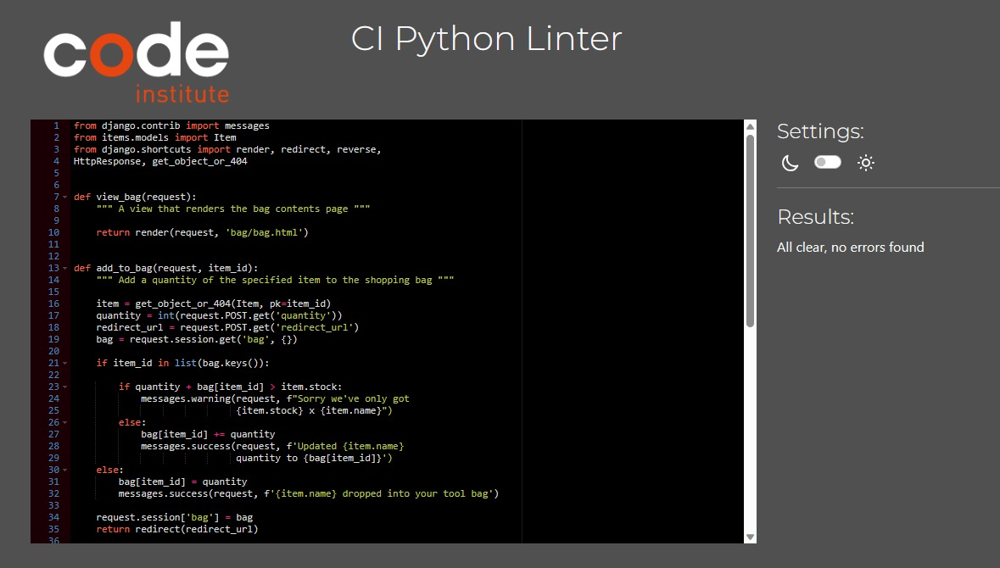
    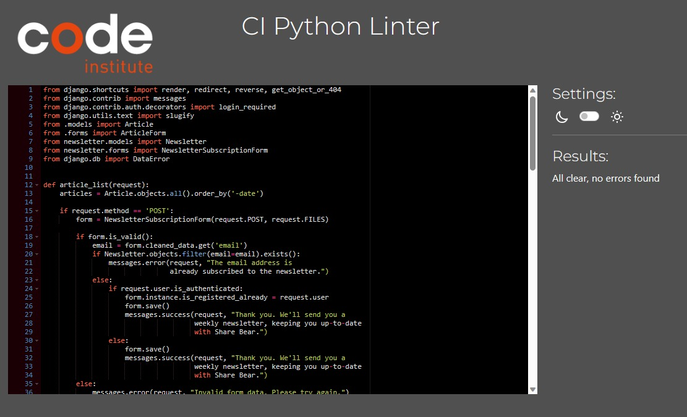
    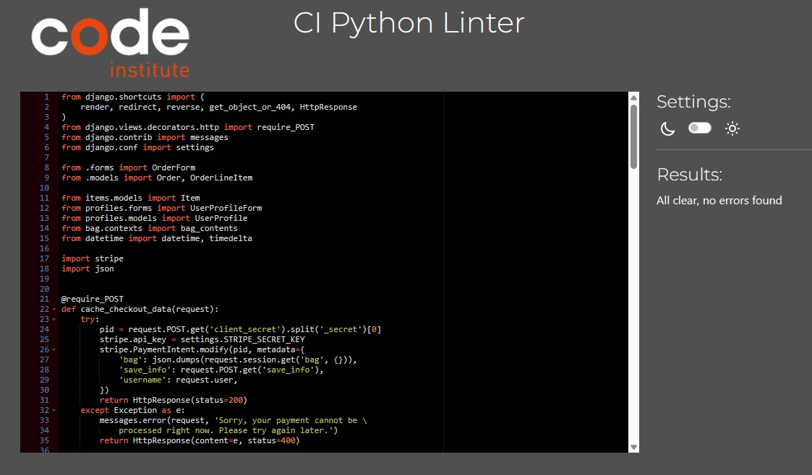

  
 

    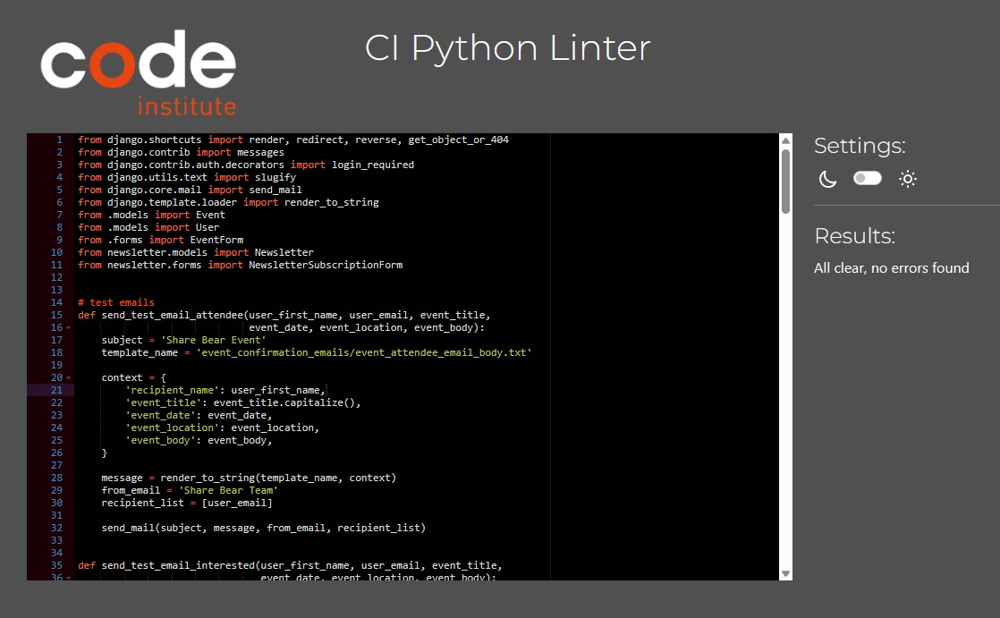
    
    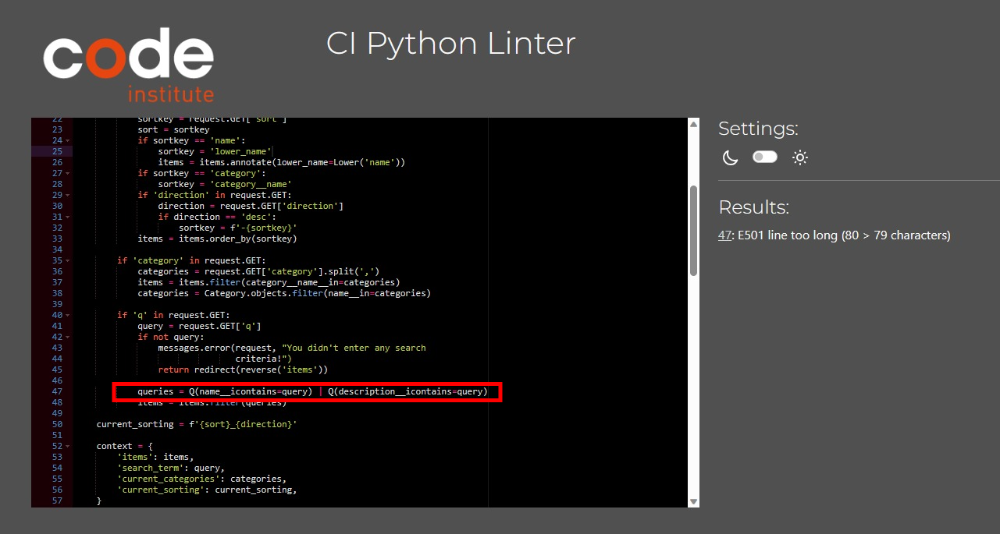
    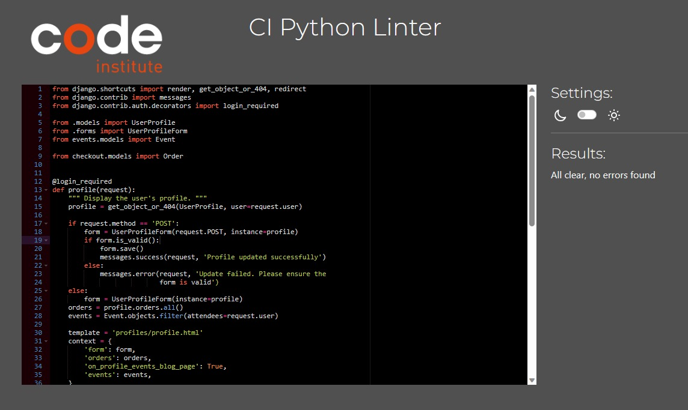

 

- Lighthouse

    

# Manual Vs Automated Testing

- I opted to **manually** test my site.  The reasons are -  

    1. As the sole developer I can quickly carry out tests as I go and can obtain immediate results from the test.
    2. As the main purpose of the site is to learn about Full Stack Frameworkds, show understanding and gain a qualification; and won't need to be maintained in the long term, I felt the time it would take to build an automated testing process was unnecessary on this occasion.  In a real-world situation, the use of a test framework, especially Django's in-built testing framework would be invaluable to ensure the continuous integrity of the site.
    3. UX testing. Important to the overall usability of the site and can only be carried out via manual testing. Automated testing lacks human observation and cognitive abilities.

- Reasons why I would use Automated Testing in the future for other projects.

    1. Larger scale site or application that may have an increased amount of functionality and code. Manual testing would take too long.
    2. Working in a team. Possibly no one person with in-depth knowledge of how the whole site should work and perform. Automated tests would allow anyone to run them.
    3. Continual code added to the site. Automated tests can be run after every addition, ensuring no disruption to the existing code.
    4. Higher accuracy. Important if the site is in the public domain and linked to an organization. To avoid deprecation of the 'brand' due to a poor website.
    5. Time. Though they take longer to set up initially, having a bespoke automated testing process will save time in the long run, due to how frequently they need to be run when maintaining and improving the site.
---

## Manual Test process  

  - The Test
### Home App
1. All navbar links work.
1. Latest Blogs and Event links work and take you to correct page.
1. Search bar works, filtering the categories and items.
1. Links for social media work.
1. Links to email and phone open respective client programmes.

### Items App

#### Item list
1. Filtering of items by Category.
1. Sorting of items. Price, Name, Category
1. Links to item details.
1. Edit and Delete works render and work for staff only

#### Item Details
1. Edit and Delete works render and work for staff only.
1. Keep Shopping and Add to Bag button work as intended.
1. Decrement button doesnt go below 1.
1. Increment button is disabled when stock quantity met.
1. Toast/messages show correct information depending on the action.
1. Bag total updated with quantity x price amount.
1. If no stock of the item -  Unavailable rendered with due back date. - Quantity button greyed out and the 'add to bag' button displaying 'Unavailable'

#### Add Item
1. Item Management link from Account in Navbar renders the Add item form.
1. Error message produced when required fields left blank.
1. Error message produced when stock number is negative.

#### Edit Item
1. Existing data prefilling fields.
1. Cancel button returns to previous page.
1. Update Item button updates the database with the new information.
1. Error message produced when required fields left blank.
1. Error message produced when stock number is negative.

#### Delete Item
1. Modal loads when delete selected from item_list and item_detail pages.
1. 'Keep' button doesnt delete the item and returns user to page.
1. 'Delete' button removes the item from the database.
1. User is returned to item_list page.

### Blog App

#### Blog/Article list
1. Page renders with all information displaying.
1. Title bar links directs you to the correct blog details.
1. 'Read  more' button directs to the correct blog details.
1. Edit and Delete buttons visable for logged in staff only.
1. Newsletter sign-up provides message confirming subscription.
1. Name and email details added to Newsletter model table.
1. Error messaging if duplicate email used.

#### Blog/Article Detail
1. Page renders with all information displaying.
1. 'Back' button directs to blog list.
1. Edit and Delete buttons visable for logged in staff only.
1. Edit and Delete buttons work directing to the correct pages.

#### Add Blog/Article
1. Blog Management link works from the main Account nav dropdown
1. Error message produced when required fields left blank.
1. Error message produced when title is over 50 characters
1. New Article is added in article_list and is present on homepage.
1. If new blog added and items in bag. Items not to display in success toast.

#### Edit Blog/Article
1. Existing data prefilling fields.
1. Cancel button returns to previous page.
1. Update Item button updates the database with the new information.
1. Errors message produced when required fields left blank.

#### Delete Blog/Article
1. Modal loads when delete selected from article_list and article_detail pages.
1. 'Keep' button doesn't delete the item and returns user to page.
1. 'Delete' button removes the article from the database.
1. User is returned to article_list page.

### Events App

#### Event list
1. Page renders with all information displaying.
1. Title bar links directs you to the correct event details.
1. 'Read  more' button directs to the correct evnet details.
1. Edit and Delete buttons visable for logged in staff only.
1. Newsletter sign-up provides message confirming subscription.
1. Name and email details added to Newsletter model table.
1. Error messaging if duplicate email used.

#### Event Detail
1. Page renders with all information displaying.
1. 'Back to our events' button directs to article list.
1. Edit and Delete buttons visable for logged in staff only.
1. Edit and Delete buttons work directing to the correct pages.
1. If user already registered for event then conditional rendering works to show this.
1. Email link opens client email.

#### Add Event
1. Event Management link works from the main Account nav dropdown
1. Error message produced when required fields left blank.
1. Error message produced when title is over 50 characters
1. New event is added in event_list and is present on homepage.
1. If new event added and items in bag. Items not to display in success toast.

#### Edit Item/Article
1. Existing data prefilling fields.
1. Cancel button returns to previous page.
1. Update Item button updates the database with the new information.
1. Error message produced when required fields left blank.

#### Delete Item/Article
1. Modal loads when delete selected from event_list and event_detail pages.
1. 'Keep' button doesn't delete the item and returns user to page.
1. 'Delete' button removes the article from the database.
1. User is returned to event_list page.
1. If event deleted, profile pages of users that were due to attend are updated correctly, removing the event.

### Profile App
1. Link to 'My Profile' from main Account Nav dropdown renders profile page.
1. Existing profile details pre-filled in fields.
1. Amending and selecting 'Update Information' updates database accordingly.
1. Order History table displaying previous orders to user.
1. Event user is registered to attend , displaying correctly.
1. Cancel button to cancel attendance to the event removes user from attendees list.

### Bag App
### Add to Bag
1. Items and quantities correctly added to bag session.
1. If item already exists in bag the quantity is increased.
1. If item already exists in bag but stock has been met then message rendered and quantity not increased.
1. After item added to bag or quantity increased, user to remain on their existing page.

###  Bag
1. Correct image, title, price, quantity and total showing.
1. 'Keep Shopping' button returns user to item_list page.
1. 'Secure Checkout' button takes user to checkout page.

### Adjust Bag
1. Selecting decrement(minus) button reduces the quantity by 1.
1. Selecting increment(plus) button increases the quantity by 1.
1. If Quantity at 1 then decrement button disabled if clicked
1. If Quantity at maximum stock amount for the item then increment button disabled if clicked.
1. 'Update' button adjusts the quantity, updating the total.
1. 'Remove' button removes the quantity value and if quantity 1 then removes item from bag.

### Checkout App
### Checkout
1. if user is logged in (authenticated) then order form is pre-filled with name, email and address.
1. if user is not logged in the order form is rendered blank.
1. Error messages present if required fields not completed.
1. Order summary displaying bag session correctly.
1. If no items in bag session error message advising this and working button to return to items_list rendered.
1. When 'Complete order' button selected post request triggered.
1. Saves order to database.
1. returns checkout_success.

### Cache_checkout-data
1.  triggered on checkout Post request.
1. Stripe payment authorised or declined.
1. If declined error message rendered advising payment declined.
1. If payment successful then returns status 400.

### Checkout-success
1. order created in database.
1. updates stock amount quantity by quantity for each item borrowed.
1. If stock update reduces to 0 then 'availableDate added 7 days from now.
1. If user authenticated user saved to order.
1. Save the users address and number information if save_info requested.(checkbox)
1. delete bag session
1. display order table with correct items, quantity, total and order number.

### Outcomes

 

I used a programme called BrowserStack to perform the tests. This is software provided as part of the course, included in the Student Developer pack.  This software allows you to load your site on a live environment on each device and browser.

The application recommended that 1 x high-end, 1 x low-end device and a tablet is tested for each main manufacturer of smart devices.  I tested Apple,Samsung and Google devices of differing size.  

Also, I've tested the site on a broad cross-section of browsers.  Chrome, Edge, Safari, Firefox and Opera.

The site performed well across all devices and browsers. All links worked as expected.  Appearance and layout looked good on all devices too.

A small selection of screenshots showing the cross-browser testing.  
Windows 11  
   
Mac Big Sur 14.1  
   
Apple Iphone 14  
  
Samsung S21 Ultra  
  
Apple Iphone SE 2022   
  
Apple iPad Pro 11  
  

---
## **BUGS** ##
1. If a user incorrectly input 60mins or over in the minute field for the cook time a DataError was produced.
    
1. When editing a recipe the cook time wasn't pre-populating, remaining empty.
1. If user clicks on 'Get random recipe' button, though it worked, the variable stored the recipe.  Meaning if the user clicked it over & over again it would show the same recipe. 
1.  When deploying my original app I ran in to a problem with the database.  It wasn't creating the database and linking to the app.  After many hours trying to resolve I decided to copy the code on to a new workspace and re-attempted the deployment.  Unfortunately my 'commits' will be linked to that original Repo ["mealplanner.2"](https://github.com/nddpj00/mealplanner.2)

## Fixes
1. The dataerror was due to using the incorrect datatype I believe.  In the form I changed the type to "time" and this resolved it immediately.
1. The data stored in the database was in the incorrect format.  By added 0 before the value on the html resolved this. ie value="0{{ recipe.cook_time }}" .
1. I added some Javascript to reload the page on the 'close' button to allow a new recipe to be set as random.
1. New workspace is this one and the deployment was successful.

### Known Bugs
No known bugs
